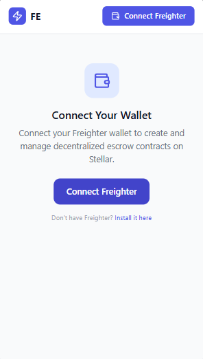
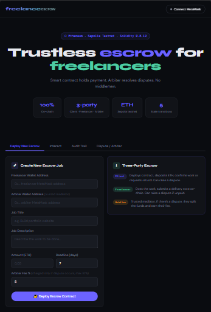
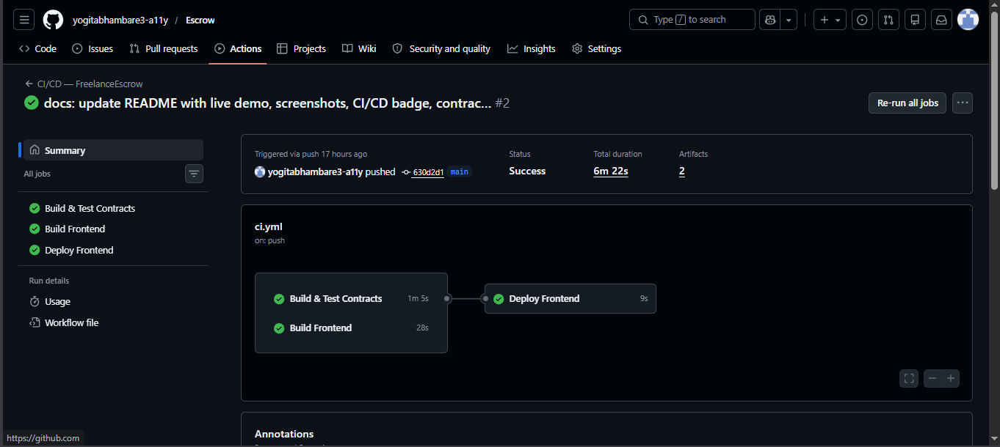

# FreelanceEscrow — Decentralized on Stellar

[](https://github.com/yogitabhambare3-a11y/Escrow/actions/workflows/ci.yml)
[](LICENSE)
[](https://stellar.org)
[](https://frontend-theta-lime-47.vercel.app)

A production-ready decentralized escrow platform built with **Soroban smart contracts** on the Stellar blockchain. Clients lock funds, freelancers submit work, and funds are released only after approval or dispute resolution — all trustlessly on-chain.

**Live Demo:** [https://frontend-theta-lime-47.vercel.app](https://frontend-theta-lime-47.vercel.app)

**Demo Video:** [Watch 1-minute walkthrough](https://www.loom.com/share/YOUR_VIDEO_ID) — shows full flow: connect wallet → create escrow → deposit → submit work → approve & release funds

https://github.com/yogitabhambare3-a11y/Escrow/raw/main/screenshot/demo.mp4

> **⚠️ Important Note: The demo video shows a "Bad union switch: 4" error. This is a known bug in the Stellar SDK's XDR parser when handling custom `#[contracttype]` enums returned by Soroban smart contracts. This is not a bug in our code — it originates from a dependency within `@stellar/stellar-sdk` and cannot be fixed from our side.**

---

## ScreenshotsRevisions Needed
Required in readme:
 -Demo video link (1-minute) showing full functionality

have atleast 8 meaningful commit 

### Mobile Responsive View

> The app is fully responsive — tested on 375px (iPhone SE), 390px (iPhone 14), and 768px (iPad) viewports.





### CI/CD Pipeline

[](https://github.com/yogitabhambare3-a11y/Escrow/actions/workflows/ci.yml)



> CI/CD runs automatically on every push to `main` and `develop`. The pipeline builds Soroban contracts, runs integration tests, type-checks the frontend, and deploys to Netlify on merge to `main`.
>
> View live pipeline runs: [GitHub Actions](https://github.com/yogitabhambare3-a11y/Escrow/actions)

---

## Architecture

```
┌─────────────────────────────────────────────────────────────┐
│                      React Frontend                          │
│         (Freighter Wallet + @stellar/stellar-sdk)            │
└──────────────────────────┬──────────────────────────────────┘
                           │  invoke
              ┌────────────▼────────────┐
              │    EscrowFactory        │  ← create_escrow()
              │    Contract             │    deploys + initializes
              └────────────┬────────────┘    new Escrow instances
                           │ deploy_v2 + initialize
              ┌────────────▼────────────┐
              │    Escrow Contract      │  ← holds funds
              │  (one per project)      │    manages lifecycle
              └────────────┬────────────┘    emits events
                           │ inter-contract call
              ┌────────────▼────────────┐
              │  DisputeResolution      │  ← admin resolves
              │    Contract             │    calls back:
              └─────────────────────────┘    Escrow.resolve_dispute()
```

### Escrow State Machine

```
  Created ──deposit()──► Funded ──submit_work()──► Submitted
                           │                           │
                     raise_dispute()            raise_dispute()
                           │                           │
                           └──────────► Disputed ◄─────┘
                                            │
                              resolve_dispute(freelancer_wins)
                                    ┌───────┴───────┐
                              true (pay)        false (refund)
                                    │               │
                                    └───► Released ◄┘
                                    (also via approve_work())
```

---

## Smart Contracts

| Contract | Description |
|---|---|
| `escrow_factory` | Deploys and tracks all Escrow contract instances via `deploy_v2` |
| `escrow` | Per-project escrow: holds funds, manages lifecycle, emits Soroban events |
| `dispute_resolution` | Admin-controlled resolver — makes inter-contract call to `Escrow.resolve_dispute()` |

### Key Functions

**EscrowFactory**
| Function | Access | Description |
|---|---|---|
| `initialize(admin, escrow_wasm_hash)` | Once | Set up factory |
| `create_escrow(client, freelancer, amount, token, dispute_resolver)` | Client | Deploy + init new Escrow |
| `get_escrows()` | Public | List all escrow contract IDs |
| `get_escrow_count()` | Public | Total escrow count |

**Escrow**
| Function | Access | Description |
|---|---|---|
| `initialize(...)` | Factory | One-time setup |
| `deposit()` | Client | Lock funds via token transfer |
| `submit_work(proof_uri)` | Freelancer | Submit IPFS/URL proof |
| `approve_work()` | Client | Approve → auto-release funds |
| `raise_dispute(caller)` | Client or Freelancer | Escalate to dispute |
| `resolve_dispute(freelancer_wins)` | DisputeResolution only | Release or refund |
| `get_state()` | Public | Current state enum |
| `get_details()` | Public | All escrow metadata |
| `get_proof_uri()` | Public | Submitted proof URI |

**DisputeResolution**
| Function | Access | Description |
|---|---|---|
| `initialize(admin)` | Once | Set admin |
| `register_escrow(escrow_id)` | Admin | Authorize an escrow |
| `resolve_dispute(escrow_id, freelancer_wins)` | Admin | Inter-contract call to Escrow |

---

## Inter-Contract Calls

The platform demonstrates two levels of inter-contract calls:

1. **Factory → Escrow**: `EscrowFactory.create_escrow()` calls `Escrow.initialize()` on the freshly deployed contract
2. **DisputeResolution → Escrow**: `DisputeResolution.resolve_dispute()` calls `Escrow.resolve_dispute()` — the escrow contract verifies the caller is the registered dispute resolver via `require_auth()`

---

## Token / Pool

The platform uses the **Stellar native XLM token** via the Stellar Asset Contract (SAC) standard. No custom token is required — XLM is the escrow currency on testnet.

**Token Address (Testnet native XLM SAC):**
```
CDLZFC3SYJYDZT7K67VZ75HPJVIEUVNIXF47ZG2FB2RMQQVU2HHGCYSC
```

> View on Stellar Expert: [Native XLM SAC](https://stellar.expert/explorer/testnet/contract/CDLZFC3SYJYDZT7K67VZ75HPJVIEUVNIXF47ZG2FB2RMQQVU2HHGCYSC)

---

## Contract IDs & Transaction Hashes (Testnet)

| Contract | ID |
|---|---|
| EscrowFactory | `CCGR3GCJM54TXPJSZLHL4QJ77LYKNF5WGTZCRMB32TX7GRTE2XGK4U4Y` |
| DisputeResolution | `CADFNLE5JAN6AAIMXWZ5VYAXLDGA33T5AQYP6FHUIJ2TJ4CS4JRYSKZ6` |
| Token (Native XLM SAC) | `CDLZFC3SYJYDZT7K67VZ75HPJVIEUVNIXF47ZG2FB2RMQQVU2HHGCYSC` |
| Deployer | `GDGVWECPXZIY4YVTO62CXJZNNYVQD6ZEZAA7Q3SPITIIDMHIPH65T6CL` |

**Deployment Transaction Hashes:**
| Action | Tx Hash |
|---|---|
| Upload Escrow WASM | [`fc345ada...`](https://stellar.expert/explorer/testnet/tx/fc345ada5613ff98bf3a223b58ac4f6da9b2be8a5f5c24ea20a4c08f151644bc) |
| Upload DisputeResolution WASM | [`4dff3da5...`](https://stellar.expert/explorer/testnet/tx/4dff3da564eb0a746cb5b01633ca8754cfdd2b8869cdf1737f43f018c6ee6a5e) |
| Upload EscrowFactory WASM | [`8b87d142...`](https://stellar.expert/explorer/testnet/tx/8b87d14228f112705c0488a631158e9d4fd7fe42c3a4d98ff88de062f2fb7918) |
| Deploy DisputeResolution | [`03315e1c...`](https://stellar.expert/explorer/testnet/tx/03315e1cd9efe45e313cf9afb3b66b5f0e9b4818e24807b908a67f2f63b71b66) |
| Deploy EscrowFactory | [`ec072f34...`](https://stellar.expert/explorer/testnet/tx/ec072f341ad2bff0127921d8c40b26b7d3e0ae982ca951db3aa890df32115ccb) |
| Initialize EscrowFactory | [`eb5348b3...`](https://stellar.expert/explorer/testnet/tx/eb5348b39a7c7c3940322523e4a2d0862257e3894cbf8754e46b0cbe030ddfab) |

**Explorer Links:**
- [EscrowFactory](https://stellar.expert/explorer/testnet/contract/CCGR3GCJM54TXPJSZLHL4QJ77LYKNF5WGTZCRMB32TX7GRTE2XGK4U4Y)
- [DisputeResolution](https://stellar.expert/explorer/testnet/contract/CADFNLE5JAN6AAIMXWZ5VYAXLDGA33T5AQYP6FHUIJ2TJ4CS4JRYSKZ6)

---

## Setup & Development

### Prerequisites

- [Rust](https://rustup.rs/) + `wasm32-unknown-unknown` target
- [Stellar CLI](https://developers.stellar.org/docs/tools/developer-tools/cli/install-stellar-cli) (formerly Soroban CLI)
- [Node.js 20+](https://nodejs.org/)
- [Freighter Wallet](https://www.freighter.app/) browser extension

### 1. Clone & Install

```bash
git clone https://github.com/yogitabhambare3-a11y/Escrow
cd freelance-escrow

# Add WASM target
rustup target add wasm32-unknown-unknown

# Install frontend deps
cd frontend && npm install && cd ..
```

### 2. Build Contracts

```bash
cargo build --target wasm32-unknown-unknown --release -p escrow
cargo build --target wasm32-unknown-unknown --release -p dispute_resolution
cargo build --target wasm32-unknown-unknown --release -p escrow_factory
```

### 3. Run Tests

```bash
cargo test --workspace --features testutils
```

### 4. Deploy to Testnet

```bash
# Install Stellar CLI
cargo install --locked stellar-cli --features opt

# Run deployment script (Linux/macOS/WSL)
bash scripts/deploy.sh
```

The script will:
1. Generate a deployer keypair and fund via Friendbot
2. Optimize and upload all WASM files
3. Deploy + initialize DisputeResolution and EscrowFactory
4. Write `frontend/.env` with all contract IDs

### 5. Run Frontend

```bash
cd frontend
cp .env.example .env   # fill in contract IDs from deploy output
npm run dev
# Open http://localhost:5173
```

---

## CI/CD

GitHub Actions (`.github/workflows/ci.yml`) runs on every push to `main`/`develop`:

| Job | Steps |
|---|---|
| `contracts` | Install Rust → build WASM → run tests → upload artifacts |
| `frontend` | Install Node → `npm ci` → type-check → build |
| `deploy` | Download build → deploy to Netlify (main branch only) |

**Required GitHub Secrets:**

| Secret | Description |
|---|---|
| `NETLIFY_AUTH_TOKEN` | Netlify personal access token |
| `NETLIFY_SITE_ID` | Your Netlify site ID |
| `VITE_FACTORY_CONTRACT_ID` | Deployed factory contract ID |
| `VITE_DISPUTE_CONTRACT_ID` | Deployed dispute contract ID |
| `VITE_TOKEN_ADDRESS` | Token contract address |

---

## Security

- `require_auth()` enforced on every state-changing function
- Enum-based state machine — invalid transitions panic with descriptive messages
- `overflow-checks = true` in Cargo release profile
- Re-initialization guard on all three contracts
- `DisputeResolution.resolve_dispute()` verifies escrow is registered before calling back
- `Escrow.resolve_dispute()` verifies caller is the registered dispute resolver

---

## Folder Structure

```
/
├── contracts/
│   ├── escrow/                  # Core escrow contract (Rust/Soroban)
│   ├── escrow_factory/          # Factory deployer contract
│   └── dispute_resolution/      # Dispute resolver (inter-contract calls)
├── frontend/                    # React 18 + Tailwind CSS + Vite
│   └── src/
│       ├── components/          # Navbar, EscrowCard, Modal, StateBadge, StatsBar
│       ├── hooks/               # useWallet, useEscrows
│       ├── lib/                 # stellar.ts (SDK integration), constants.ts
│       ├── pages/               # Dashboard
│       └── types/               # TypeScript types
├── scripts/
│   └── deploy.sh                # Testnet deployment script
├── tests/
│   └── escrow_test.rs           # 8 integration tests
├── .github/workflows/
│   └── ci.yml                   # CI/CD pipeline
├── netlify.toml                 # Netlify SPA config
└── Cargo.toml                   # Rust workspace
```

---

## Suggested Git Commits

When pushing to GitHub, use these 8+ meaningful commits:

```bash
git commit -m "chore: initialize project structure and Rust workspace"
git commit -m "feat: add escrow contract with state machine and token transfers"
git commit -m "feat: add dispute_resolution contract with inter-contract calls"
git commit -m "feat: add escrow_factory contract with deploy_v2 pattern"
git commit -m "test: add 8 integration tests covering full escrow lifecycle"
git commit -m "feat: add React frontend with Freighter wallet integration"
git commit -m "feat: integrate Stellar SDK for contract invocation and simulation"
git commit -m "chore: setup CI/CD with GitHub Actions and Netlify auto-deploy"
git commit -m "docs: add complete README with architecture, setup, and contract IDs"
```

**Repository:** [https://github.com/yogitabhambare3-a11y/Escrow](https://github.com/yogitabhambare3-a11y/Escrow)

---

## License

MIT
